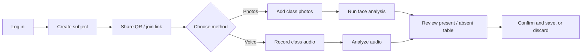
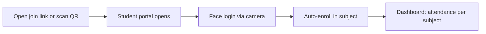
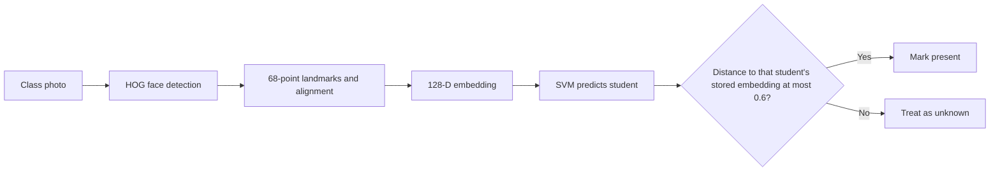
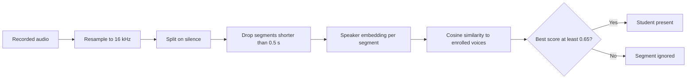
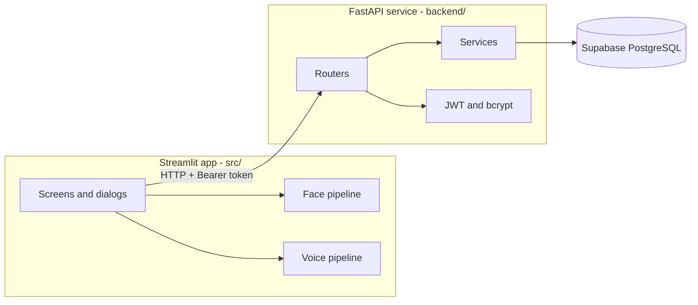
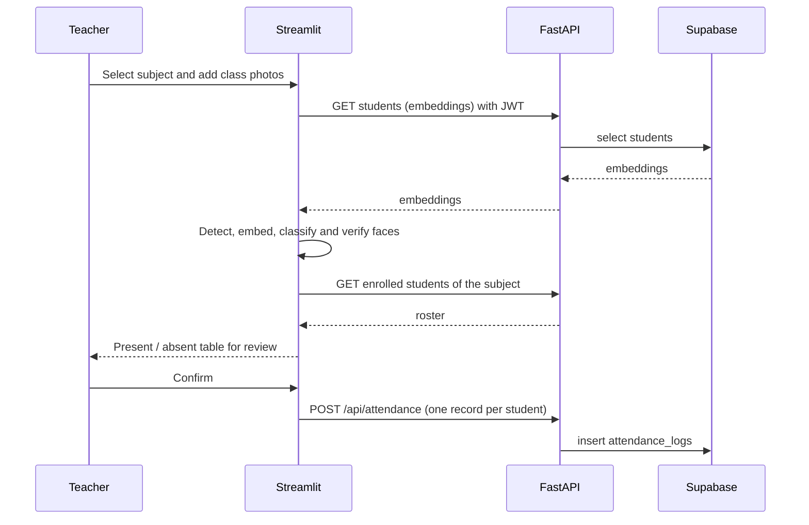
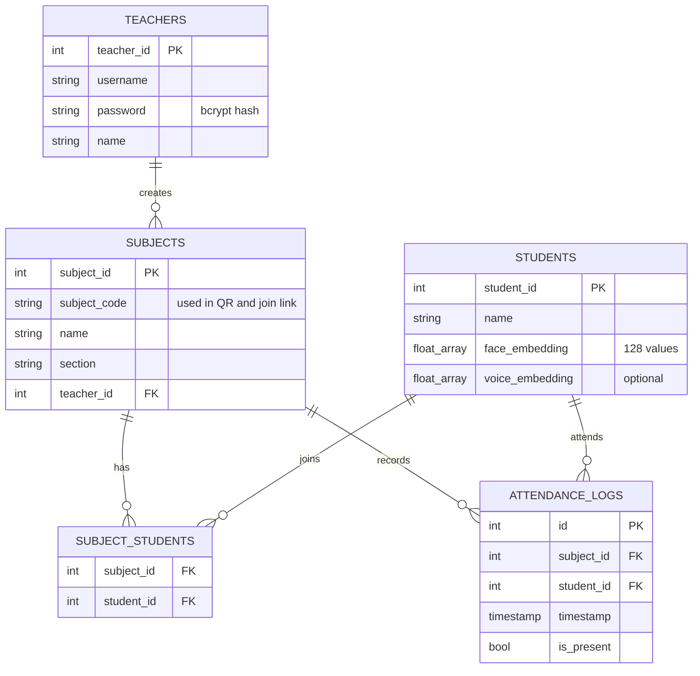

<h1 align="center">AURA: AI Unified Recognition Attendance</h1>

<p align="center">
  Take a whole class's attendance from a single group photo or a short voice roll-call.
</p>

<p align="center">
  <a href="https://aura-main.streamlit.app/"><b>Live App</b></a> ·
  <a href="https://aura-landing-page-opal.vercel.app/"><b>Landing Page</b></a>
</p>

<p align="center">
  
  
  
  
</p>

<p align="center">
  
</p>

---

## Table of contents

1. [Overview](#overview)
2. [Demo](#demo)
3. [Features](#features)
4. [User flows](#user-flows)
5. [How the recognition works](#how-the-recognition-works)
6. [System architecture](#system-architecture)
7. [Data model](#data-model)
8. [Authentication and security](#authentication-and-security)
9. [Tech stack](#tech-stack)
10. [Project structure](#project-structure)
11. [Getting started](#getting-started)
12. [Configuration reference](#configuration-reference)
13. [API reference](#api-reference)
14. [Deployment](#deployment)
15. [Troubleshooting](#troubleshooting)
16. [Limitations and roadmap](#limitations-and-roadmap)
17. [Privacy and ethics](#privacy-and-ethics)
18. [Author](#author)

---

## Overview

Taking attendance by roll call costs class time every day, and it lets students answer for absent friends ("proxy attendance"). **AURA** replaces it with biometric recognition:

- **Face attendance:** the teacher uploads one or more classroom photos, and AURA finds every face and marks the matching students present.
- **Voice attendance:** students say "I am present" one after another into a single recording, and AURA identifies each speaker.
- **Frictionless enrollment:** students join a subject by scanning a QR code or opening a link, and log in using their face.

Both modalities follow the same idea: convert a face or a voice into a fixed-length **embedding vector**, then compare it with the vectors stored for enrolled students. Nobody compares raw images or audio.

## Demo

| | Link |
|---|---|
| Live application | https://aura-main.streamlit.app/ |
| Landing page | https://aura-landing-page-opal.vercel.app/ |

## Features

**For teachers**
- Register and log in with a username and password.
- Create subjects (code, name, section) and share each one as a **QR code** or **join link**.
- **Face attendance:** add several class photos for one session. A student is marked present if they are recognized in any of the photos, and the results table shows which photo each student was found in.
- **Voice attendance:** record one clip and let AURA identify each speaker. Only students who enrolled a voice sample can be matched.
- **Review before saving:** a present/absent table is shown first, and the records are written only when the teacher presses **Confirm & Save** (or discarded with **Discard**).
- **Attendance records:** a history of sessions per subject with the present/total count for each.
- **Manage subjects:** each subject card shows its student and class counts, with a button to share its code or QR.

**For students**
- **FaceID login:** no password, just the camera.
- Join subjects through a QR code or a `?join-code=<subject_code>` link, which opens the app and starts the enrollment automatically.
- A dashboard of enrolled subjects with **total sessions** and **sessions attended** for each.
- Unenroll from a subject at any time.
- Optional **voice enrollment** (a short phrase such as "I am present") for voice-only attendance.

## User flows

### Teacher: taking attendance



### Student: enrollment and login



## How the recognition works

### Face pipeline

Source: `src/pipelines/face_pipeline.py`



1. **Detection:** dlib's frontal face detector (HOG features and a linear SVM) scans the image, upsampled once so small faces in a group photo are found.
2. **Alignment:** a 68-point shape predictor locates the facial landmarks so each face is normalized before encoding.
3. **Embedding:** dlib's ResNet-based model maps each face to a 128-dimensional vector. Faces of the same person land close together.
4. **Identification:** a linear **SVM** (`probability=True`, `class_weight="balanced"`) trained on all stored face embeddings predicts which student the face belongs to. The classifier is retrained whenever a student registers.
5. **Verification:** the Euclidean distance between the face and the predicted student's stored embedding must be at most **0.6**. Otherwise the face is rejected, so people who are not enrolled are not marked present.

**Student FaceID login** skips the SVM. The backend compares the camera face against every stored embedding by Euclidean distance and accepts the closest one if it is within the same 0.6 threshold. Login requires exactly one face in the frame.

### Voice pipeline

Source: `src/pipelines/voice_pipeline.py`



1. **Loading:** the audio is decoded and resampled to 16 kHz mono (`librosa`).
2. **Segmentation:** `librosa.effects.split(top_db=30)` separates stretches of speech from silence. Each stretch is treated as one student speaking, and segments under 0.5 seconds are discarded as noise.
3. **Embedding:** each segment is volume-normalized and passed through Resemblyzer's `VoiceEncoder`, a d-vector speaker model trained with the GE2E loss, producing a normalized vector.
4. **Matching:** the dot product with every enrolled voice vector gives the cosine similarity. The best match is accepted only if it scores at least **0.65**. If a student is detected in several segments, the highest score is kept.

### Thresholds at a glance

| Check | Metric | Threshold |
|---|---|---|
| Face attendance (after SVM) | Euclidean distance | ≤ 0.6 |
| Student FaceID login | Euclidean distance | ≤ 0.6 |
| Voice attendance | Cosine similarity | ≥ 0.65 |
| Minimum voice segment | Duration | ≥ 0.5 s |

Raising a threshold makes matching stricter (fewer false accepts, more missed students). Lowering it does the opposite.

## System architecture



- The **Streamlit app** hosts the UI and runs the face and voice models. It talks to the backend through a small HTTP client (`src/api/client.py`) that attaches the JWT.
- The **FastAPI service** is layered into routers (HTTP), services (business logic) and schemas (validation), and it is the only layer that applies authorization rules to the data.
- **Supabase** stores users, subjects, enrollments, embeddings and attendance logs.

### Attendance request sequence



## Data model



`subject_students` is the join table for the many-to-many relationship between students and subjects.

## Authentication and security

| Concern | Approach |
|---|---|
| Teacher passwords | Hashed with **bcrypt** and a per-password salt. Plain passwords are never stored. |
| Sessions | **JWT** access tokens (`HS256`) carrying the user id (`sub`), the role and an expiry (60 minutes by default). |
| Transport of tokens | `Authorization: Bearer <token>` header on every API call. |
| Student authentication | Face login issues a student-role JWT after a successful embedding match. |
| Authorization | Teachers can only write attendance for subjects they own, and students can only manage their own enrollments and read their own attendance. |
| Secrets | Keys and the JWT secret are read from `.env` / Streamlit secrets and excluded from git. |

## Tech stack

| Area | Tools |
|---|---|
| Frontend | Streamlit, Pillow, pandas, NumPy |
| Backend | FastAPI, Uvicorn, Pydantic, pydantic-settings |
| Database | Supabase (PostgreSQL) |
| Face recognition | dlib, `face_recognition_models`, scikit-learn (SVM) |
| Voice recognition | Resemblyzer, librosa |
| Auth and security | `python-jose` (JWT), bcrypt |
| Utilities | segno (QR codes), requests, pytest, httpx |

## Project structure

```
.
├── app.py                      # Streamlit entry point, role routing, join-link handling
├── requirements.txt
├── assets/                     # Logo and portal images
├── docs/screenshots/           # Screenshots used in this README
├── src/                        # Frontend
│   ├── screens/                # home, teacher and student screens
│   ├── components/             # dialogs (create subject, enroll, share, voice, results), header, footer
│   ├── pipelines/
│   │   ├── face_pipeline.py    # detection, embedding, SVM, verification
│   │   └── voice_pipeline.py   # segmentation, speaker embedding, matching
│   ├── api/                    # HTTP client and per-resource API wrappers
│   ├── core/session.py         # login state and role switching
│   └── ui/                     # layout and styling
└── backend/                    # FastAPI service
    ├── main.py                 # app and router registration
    ├── config.py               # settings loaded from .env
    ├── api/                    # routers: auth, student_auth, students, subjects, enrollments, attendance
    ├── services/               # business logic and database access
    ├── schemas/                # Pydantic request and response models
    ├── core/                   # JWT creation / verification and auth dependencies
    └── database/supabase.py    # Supabase client
```

## Getting started

### Prerequisites

- Python 3.11
- A [Supabase](https://supabase.com) project
- A webcam and microphone (or uploaded files) to try face and voice features

### 1. Clone and install

```bash
git clone https://github.com/ishara16/aura-ai-unified-recognition-attendance.git
cd aura-ai-unified-recognition-attendance

python -m venv venv
source venv/bin/activate          # Windows: venv\Scripts\activate
pip install -r requirements.txt
```

### 2. Set up Supabase

Create the tables described in the [Data model](#data-model): `teachers`, `students`, `subjects`, `subject_students` and `attendance_logs`. Store the two embedding columns as arrays (for example `float8[]`) or JSON.

### 3. Configure the backend

Create a `.env` file in the project root:

```env
SUPABASE_URL=your-supabase-project-url
SUPABASE_KEY=your-supabase-key
JWT_SECRET_KEY=a-long-random-secret
```

### 4. Configure the frontend

Create `.streamlit/secrets.toml`:

```toml
SUPABASE_URL = "your-supabase-project-url"
SUPABASE_KEY = "your-supabase-key"
API_BASE_URL = "http://127.0.0.1:8000"
```

### 5. Run

Backend (terminal 1):

```bash
uvicorn backend.main:app --reload
```

Frontend (terminal 2):

```bash
streamlit run app.py
```

- App: http://localhost:8501
- Interactive API docs (Swagger): http://127.0.0.1:8000/docs
- Health check: http://127.0.0.1:8000/health

## Configuration reference

**Backend (`.env`)**

| Variable | Required | Default | Description |
|---|---|---|---|
| `SUPABASE_URL` | Yes | | Supabase project URL |
| `SUPABASE_KEY` | Yes | | Supabase API key |
| `JWT_SECRET_KEY` | Yes | | Secret used to sign tokens |
| `JWT_ALGORITHM` | No | `HS256` | JWT signing algorithm |
| `JWT_ACCESS_TOKEN_EXPIRE_MINUTES` | No | `60` | Token lifetime |

**Frontend (`.streamlit/secrets.toml`)**

| Key | Required | Default | Description |
|---|---|---|---|
| `SUPABASE_URL` | Yes | | Supabase project URL |
| `SUPABASE_KEY` | Yes | | Supabase API key |
| `API_BASE_URL` | No | `http://127.0.0.1:8000` | Base URL of the FastAPI service |

## API reference

All routes except registration and login require `Authorization: Bearer <token>`. Full request and response schemas are in the Swagger docs at `/docs`.

| Method | Endpoint | Description |
|---|---|---|
| POST | `/api/auth/teacher/register` | Create a teacher account |
| POST | `/api/auth/teacher/login` | Teacher login, returns a JWT |
| GET | `/api/auth/me` | Current authenticated user |
| POST | `/api/auth/student/login` | Student login |
| POST | `/api/auth/student/face-login` | Student login with a face embedding |
| POST | `/api/students` | Register a student with face and optional voice embeddings |
| GET | `/api/students` | List students |
| GET | `/api/students/{student_id}` | Get one student |
| POST | `/api/subjects` | Create a subject (`subject_code`, `name`, `section`) |
| GET | `/api/subjects` | List the teacher's subjects |
| GET | `/api/subjects/{subject_id}/students` | Students enrolled in a subject |
| GET | `/api/subjects/{subject_id}/voice-students` | Enrolled students with a voice profile |
| POST | `/api/enrollments` | Student enrolls using a `subject_code` |
| GET | `/api/enrollments/me` | Subjects the student is enrolled in |
| DELETE | `/api/enrollments/{subject_id}` | Unenroll from a subject |
| POST | `/api/attendance` | Save one attendance record (`subject_id`, `student_id`, `is_present`, `timestamp`) |
| GET | `/api/attendance` | Teacher's attendance records, with subject info |
| GET | `/api/attendance/me` | The student's own attendance |
| GET | `/health` | Service health check |

## Deployment

The project is deployed as three pieces:

| Piece | Where | Notes |
|---|---|---|
| Streamlit app | Streamlit Community Cloud (https://aura-main.streamlit.app/) | Add `SUPABASE_URL`, `SUPABASE_KEY` and `API_BASE_URL` in the app's secrets. |
| Landing page | Vercel (https://aura-landing-page-opal.vercel.app/) | Static marketing page linking to the app. |
| FastAPI backend | Any host that can run Uvicorn | Set the `.env` variables as environment variables, then point `API_BASE_URL` at its public URL. |

Start command for the backend: `uvicorn backend.main:app --host 0.0.0.0 --port $PORT`.

## Troubleshooting

| Problem | Likely cause and fix |
|---|---|
| `dlib` fails to install | The project uses the prebuilt `dlib-bin` package, so a compiler is not needed. Use Python 3.11. |
| `face_recognition_models` import error | Keep `setuptools<81` installed, as pinned in `requirements.txt`. |
| `KeyError` for a secret on startup | `.streamlit/secrets.toml` is missing or lacks `SUPABASE_URL` / `SUPABASE_KEY`. |
| Frontend cannot reach the API | Check that Uvicorn is running and that `API_BASE_URL` matches its address. |
| "Face not found" or "Multiple faces found" at login | Use good, even lighting and keep only one face in frame. |
| Student is missed in a group photo | Use a higher-resolution photo with faces turned towards the camera, or add several photos in one session. |
| Voice attendance finds nobody | Students must have enrolled a voice sample. Record in a quiet room with a short pause between speakers. |
| Token errors or sudden logouts | Tokens expire after 60 minutes by default. Log in again. |

## Limitations and roadmap

- Recognition uses pretrained models, so results depend on lighting, face size, pose and audio quality.
- No **liveness or anti-spoofing** check yet, so a printed photo or a replayed recording could be accepted.
- Voice segmentation assumes one student speaks at a time with short pauses between speakers.
- The face classifier is retrained when a student registers and compares against one stored embedding per student.
- Unit and API tests are not written yet (`pytest` and `httpx` are already in the requirements).

Planned improvements:
- [ ] Liveness detection for face login and attendance
- [ ] Multiple enrollment images per student
- [ ] Vector search (pgvector) for embedding lookups
- [ ] CSV export and per-student attendance percentage
- [ ] Automated tests and CI

## Privacy and ethics

Face and voice embeddings are biometric data. Use AURA only with the informed consent of the people being enrolled, tell them what is stored and why, and protect the database and API keys accordingly. Store only embeddings, not raw photos or audio, and delete a person's data on request.

## Author

Built by **Khushi Srivastava**.

If you find this project useful, consider giving it a star.
